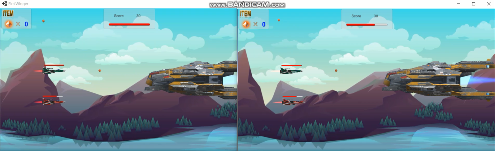
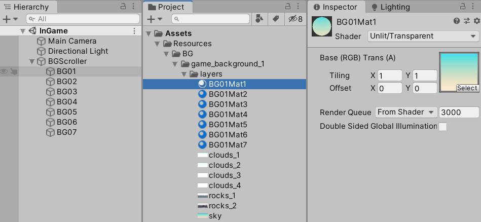
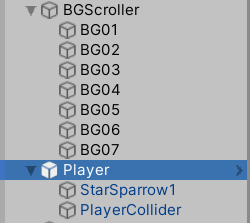
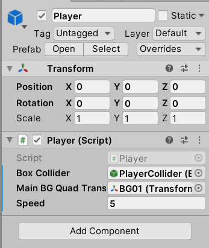
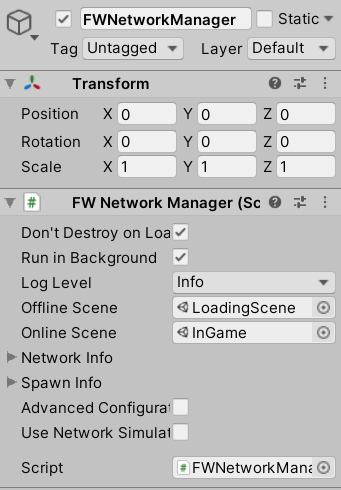
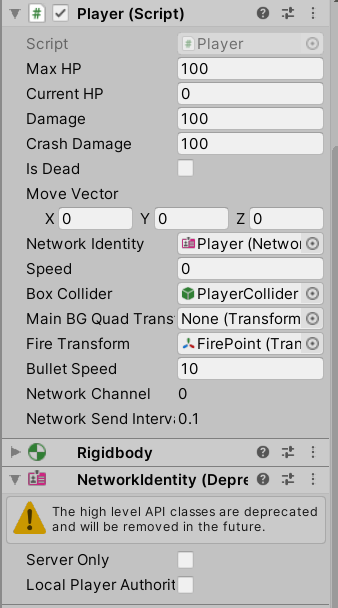
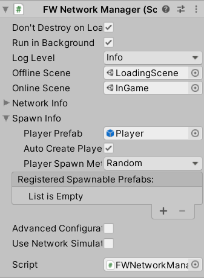
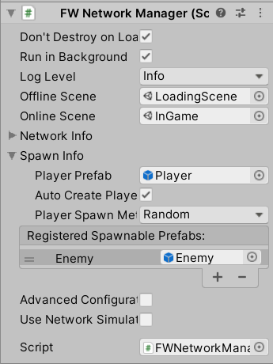

# First Winger
</img></br></br>
[플레이 영상](https://blog.naver.com/zoqxlstm6)
## 프로젝트 소개
강의를 수강하며 제작해 본 유니티 HLAPI를 이용한 멀티플레이 슈팅 게임.</br>
유니티에서의 각각의 객체에 대한 기능 처리와 코드를 객체지향적으로 분리해서 만드는 구조에 대해 중점적으로 학습 해보았습니다. 코드를 이해하며 자세한 주석처리를 해놓았습니다.
### 주요 기능
- 배경 스크롤 기능
- 플레이어 이동 제어
- Resources 클래스를 이용한 캐싱
- 총알 Lincecast 처리
- 적 및 총알 생성/삭제에 대한 부하 해결
- 파티클 자동 삭제 처리
- PanelManger 클래스를 통한 UI 패널 관리
- CSV 파일을 이용한 마샬링을 통해 데이터 로드
- 각 씬에 배치된 Scene 관리 클래스
- HLAPI를 이용한 멀티플레이 구성 및 동기화
- 아이템 드랍 및 CSV 테이를을 이용한 확률 처리
- 대형 폭탄 스킬 구현
- 보스 등장 UI 연출
- 보스 구현 및 패턴 구현
- 보스 유도 미사일 구현
#### 배경 스크롤
1. Texture Material 생성</br></br>
</br></br>
2. offset 변경을 통한 배경 스크롤 효과
```c#
// 직렬화
[System.Serializable]
public class BGScrollData
{
    public Renderer renderForScroll;    // 텍스쳐 메테리얼이 적용된 렌더러
    public float speed;                 // 오프셋 이동 속도
    public float offsetX;               // 텍스쳐 메테리얼 오프셋 값
}
```
```c#
// 텍스쳐 메테리얼의 오프셋을 설정
void SetTextureOffset(BGScrollData scrollData)
{
    // 초당 오프셋을 이동
    scrollData.offsetX += scrollData.speed * Time.deltaTime;
    if (scrollData.offsetX > 1)
        scrollData.offsetX = scrollData.offsetX % 1f;

    // 변경 오프셋을 텍스처 메테리얼에 적용
    Vector2 offset = new Vector2(scrollData.offsetX, 0);
    scrollData.renderForScroll.material.SetTextureOffset("_MainTex", offset);
}
```
#### 플레이어가 화면 밖으로 벗어나지 못하도록 이동 제어
- 배경 객체의 스케일 값과 플레이어의 박스 콜라이더 값을 이용하여 플레이어가 화면 안에서만 움직이도록 구현</br></br>
</img>
</img></br>
```c#
// 박스 콜라이더를 통해 화면 밖으로 나가는지 확인
Vector3 AdjustMoveVector(Vector3 moveVector)
{
    Vector3 result = Vector3.zero;

    // 플레이어 박스 콜라이더의 위치 계산
    result = boxCollider.transform.position + boxCollider.center + moveVector;

    // 왼쪽 (콜라이더의 왼쪽 끝부분 < 배경 객체 스케일값의 왼쪽 끝보다 작아진다면)
    if (result.x - boxCollider.size.x * 0.5f < -mainBGQuadTransform.localScale.x * 0.5f)
        moveVector.x = 0;
    // 오른쪽
    if (result.x + boxCollider.size.x * 0.5f > mainBGQuadTransform.localScale.x * 0.5f)
        moveVector.x = 0;
    // 아래쪽
    if (result.y - boxCollider.size.y * 0.5f < -mainBGQuadTransform.localScale.y * 0.5f)
        moveVector.y = 0;
    // 위쪽
    if (result.y + boxCollider.size.y * 0.5f > mainBGQuadTransform.localScale.y * 0.5f)
        moveVector.y = 0;

    return moveVector;
}
```
#### Resources 클래스를 이용한 EnemyFactory 클래스 생성
1. Enemy 프리팹을 파일로 로드
2. Instantiate를 통해 Scene에 배치
3. 로드된 프리팹은 파일 경로를 키로 사용하여 캐싱
- 로딩 부하 감소
- 중복된 로딩을 통해 메모리가 중복되어 사용되어지는 것을 방지
```c#
Resources.Load<T>(string path)
```
```c#
// 에너미가 있는 파일 경로를 키값으로 사용
// Resources 폴더 하위 경로를 지정
public const string EnemyPath = "Prefabs/Enemy";

// 캐싱을 하기 위해서 Dictionary 자료구조 사용
Dictionary<string, GameObject> enemyFileCache = new Dictionary<string, GameObject>();

// 게임오브젝트 로드
public GameObject Load(string resourcePath)
{
    GameObject go = null;

    // key값을 확인하여 캐싱이 되었다면 캐싱되어진 게임오브젝트를 가져옴
    if (enemyFileCache.ContainsKey(resourcePath))
    {
        go = enemyFileCache[resourcePath];
    }// 로드가 되지 않은 경우
    else
    {
        // Resources 클래스를 이용하여 메모리 로드
        go = Resources.Load<GameObject>(resourcePath);
        if (!go)
        {
            Debug.LogError("Load Error! path = " + resourcePath);
            return null;
        }

        // 로드가 정상적으로 이루어진 경우 캐쉬에 넣어준다
        enemyFileCache.Add(resourcePath, go);
    }

    // 디버그상 유리하기 때문에 한번 받아서 리턴
    GameObject instancedGo = Instantiate(go);
    return instancedGo;
}
```
#### 총알 Lincecast 처리
- Linecast를 활용하여 총알이 너무 빨리 움직였을 때의 문제점을 보완해준다.
- 현재 위치와 다음 위치로의 Line을 이용하여 충돌된 오브젝트가 있는지 체크
```c#
// 총알이 너무 빨리 움직였을 때를 대비한 moveVector 수정 함수
Vector3 AdjustMove(Vector3 moveVector)
{
    RaycastHit hit;

    // Raycast: 시점은 있고 종점은 없다. 무한히 뻗어감
    // Linecast: 시점과 종점이 있다.
    // 부딪힌 경우
    if (Physics.Linecast(transform.position, transform.position + moveVector, out hit))
    {
        // moveVector를 충돌지점의 거리만큼으로 수정해준다.
        moveVector = hit.point - transform.position;
        // 충돌 처리 함수 호출
        OnBulletCollision(hit.collider);
    }

    return moveVector;
}
```
#### 적 및 총알 생성/삭제에 대한 부하 해결하기
> EnemyFactory 클래스는 단순 로드하는 기능만 수행하도록 변경됨
##### Prefab 캐시 시스템 제작
- 프리팹 생성 부하를 감소 시키는 목적
- Instantiate 부하를 줄이기 위함
- 적 캐시
- 총알 캐시
- 이펙트 캐시
- 데미지텍스트 캐시
##### PrefabCacheSystem 클래스
- MonoBehaviour를 상속하지 않음
- GenerateCache: 캐시 생성 메소드
- Archive: 캐시에서 꺼낼 때 사용
- Restore: 캐시로 반환할 때 사용
- SystemManager가 소유한 상태
```c#
// 캐싱된 정보를 담을 Dictionary
Dictionary<string, Queue<GameObject>> caches = new Dictionary<string, Queue<GameObject>>();
```
```c#
/// <summary>
/// 캐시 생성 함수
/// </summary>
/// <param name="filePath">파일 위치</param>
/// <param name="gameObject">캐싱할 게임오브젝트</param>
/// <param name="cacheCount">몇개를 만들것인지</param>
public void GenerateCache(string filePath, GameObject gameObject, int cacheCount)
{
    // 파일경로의 키값이 저장되어있다면 리턴
    if (caches.ContainsKey(filePath))
    {
        Debug.LogWarning("Already cache generated! filePath: " + filePath);
            return;
    }// 캐싱되어있지 않다면
    else
    {
        Queue<GameObject> queue = new Queue<GameObject>();
        // cacheCount 만큼 게임 오브젝트 생성
        for (int i = 0; i < cacheCount; i++)
        {
            GameObject go = Object.Instantiate(gameObject);
            go.SetActive(false);
            queue.Enqueue(go);
        }

        // 데이터를 저장
        caches.Add(filePath, queue);
    }
}
```
```c#
/// <summary>
/// 캐싱된 데이터 사용
/// </summary>
/// <param name="filePath">파일경로를 이용한 키값</param>
/// <returns>캐싱된 오브젝트 반환</returns>
public GameObject Archive(string filePath)
{
    // 키값이 있는지 검사
    if (!caches.ContainsKey(filePath))
    {
        Debug.LogError("Archive Error! no cache generated. filePath: " + filePath);
        return null;
    }

    // queue에 남아있는 오브젝트가 없다면 warning 처리
    if(caches[filePath].Count == 0)
    {
        Debug.LogWarning("Archive problem! not enough count.");
        return null;
    }

    // 키값에 해당하는 데이터 반환
    GameObject go = caches[filePath].Dequeue();
    go.SetActive(true);

    return go;
}
```
```c#
/// <summary>
/// 사용한 오브젝트 캐시로 반환
/// </summary>
/// <param name="filePath">파일경로를 이용한 키값</param>
/// <param name="gameObject">반환할 오브젝트</param>
/// <returns>반환 성공 여부</returns>
public bool Restore(string filePath, GameObject gameObject)
{
    // 키값이 존재하는지 확인
    if (!caches.ContainsKey(filePath))
    {
        Debug.LogError("Restore Error! no cache generated. filePath: " + filePath);
        return false;
    }

    // 비활성화 후 caches로 오브젝트 반환 처리
    gameObject.SetActive(false);

    caches[filePath].Enqueue(gameObject);
    return true;
}
```
#### 파티클 자동 삭제 처리
> [RequireComponent(typeof(ParticleSystem))]
```c#
private void OnEnable()
{
    StartCoroutine("CheckIfAlive");
}

// 파티클이 살아있는지 확인
IEnumerator CheckIfAlive()
{
    while (true)
    {
        yield return new WaitForSeconds(0.5f);
        // 파티클 실행이 종료가 되었다면
        if (!GetComponent<ParticleSystem>().IsAlive(true))
        {
            // 파티클 삭제 함수 호출
            SystemManager.Instance.EffectManager.RemoveEffect(this);
            break;
        }
    }
}
```
#### 필요 이상의 부하가 생길 수 있는 상황들
- 파일 로딩
    - 중복된 파일을 다시 로딩하지 않도록 만들 것.
    - 게임이 시작되기 전 미리 로딩 해놀기
- 생성할 때 (Instantiate 호출)
    - 캐시를 만들어 놓고 필요할 때 꺼내는 쓰는 방법으로
- Active 될 때
    - 대량으로 Active 될 때
    - 여러개의 계층을 갖는 구조 일 때
    - Active인 상태로 두되 화면에 보이지 않는 좌표로 보낸 뒤
        - 필요하지 않을 때는 update같은 함수가 불리지 않도록 처리하기
        - 렌더러 처리를 방지하기 위해 렌더러를 끄기
#### Slider의 사용법
- 하위 오브젝트로 Background, Fill Area, Handle Slide Area로 구성
- 실행 시 Handle Slide Area를 잡고 드래그하면 Value가 0~1까지 변화되며 Fill Area의 크기가 변함
- 퍼센트 단위로 표현되어야 하는 UI 오브젝트에 사용
#### BasePanel 클래스를 상속하는 Panel을 관리하는 클래스
```c#
// BasePanel Class

/// <summary>
/// 초기화
/// </summary>
public virtual void InitializePanel() {}

/// <summary>
/// 오브젝트 파괴시 필요한 동작 처리
/// </summary>
public virtual void DestroyPanel() {}

/// <summary>
/// 패널을 보여주는 함수
/// </summary>
public virtual void Show() {}

/// <summary>
/// 패널을 닫는 함수
/// </summary>
public virtual void Close() {}
```
```c#
// PanelManager Class

// 등록된 패널들을 관리할 변수
static Dictionary<Type, BasePanel> panels = new Dictionary<Type, BasePanel>();

/// <summary>
/// 패널 등록
/// </summary>
/// <param name="panelClassType">등록할 패널 클래스 타입</param>
/// <param name="basePanel">등록할 패널 정보</param>
/// <returns></returns>
public static bool RegistPanel(Type panelClassType, BasePanel basePanel) {}

/// <summary>
/// 패널 등록 해제
/// </summary>
/// <param name="panelClassType">등록 해제 할 패널 클래스 타입</param>
/// <returns></returns>
public static bool UnregistPanel(Type panelClassType) {}

/// <summary>
/// 등록된 패널 정보를 얻어오는 함수
/// </summary>
/// <param name="panelClassType">얻어올 패널 클래스 타입</param>
/// <returns></returns>
public static BasePanel GetPanel(Type panelClassType) {}
```
#### CSV 파일을 이용한 마샬링을 통해 데이터 로드
- TableRecordParser: 마샬링을 이용하여 레코드를 구조체로 변환. 템플릿 형태로 제작
- TableLoader: .csv 파일을 읽어들이고 TableRecordParser를 통해 읽어들인 정보를 구조체로 변환. TableLoader를 상속받은 클래스가 변환된 구조체를 저장할 수 있도록 제작
- EnemyTable: 로딩 및 저장소 클래스. 데이터에 접근할 수 있는 메소드 제공
#### BaseSceneMain 클래스 - Scene을 관리하는 클래스
- Scene마다 사용할 클래스의 부모 클래스
- 상속된 클래스는 해당 Scene에 전역적인 정보와 기능을 제공
- 각 SceneMain 클래스의 공통 기능을 구현
- SystemManager를 통해 접근
#### 비동기 씬로딩
```c#
/// <summary>
/// 비동기 로드
/// </summary>
/// <param name="sceneName">비동기 로드할 씬이름</param>
/// <param name="loadSceneMode">씬을 어떻게 로드할지 모드 지정</param>
IEnumerator LoadSceneAsync(string sceneName, LoadSceneMode loadSceneMode)
{
    AsyncOperation asyncOperation = SceneManager.LoadSceneAsync(sceneName, loadSceneMode);

    // 씬로드가 끝나면 isDone이 True로 바뀜
    while (!asyncOperation.isDone)
    {
        yield return null;
    }

    Debug.Log("LoadSceneAsync is complete.");
}
```
#### SceneManager 이벤트 메소드
```c#
// 현재 활성화된 씬이 바뀔 때 받는 이벤트 메소드
SceneManager.activeSceneChanged += OnActiveSceneChanged;
// 씬이 로드되었을 때 받는 이벤트 메소드
SceneManager.sceneLoaded += OnSceneLoaded;
// 씬이 언로드되었을 때 받는 이벤트 메소드
SceneManager.sceneUnloaded += OnSceneUnloaded;
```
#### LoadSceneMode
- LoadSceneMode.Single: 이전 Scene을 Unload하고 로딩
- LoadSceneMode.Additive: 이전 Scene의 Unload없이 로딩
#### HLAPI를 이용한 멀티플레이
- NetworkManger를 상속하는 FWNetworkManager 클래스 작성
1. 로딩씬과 인게임씬 연결</br></br>
</img></br></br>
2. Actor 클래스 수정 
- 네트워크 동작을 하기 위해서 Actor 클래스가 NetworkBehaviour를 상속하도록 수정
3. Player 클래스 수정
- 이동이 동기화 될 수 있도록 moveVector 변수에 SyncVar 어트리뷰트 추가
- CmdMove 메소드를 추가하고 UpdateMove에서 사용하도록 수정
- 서버가 알아볼 수 있도록 SerializeField 어트리뷰트로 NetworkIdentity 변수 추가 후 Player 링크</br></br>
</img></br></br>
- Initialize 메소드에서 isLocalPlayer 체크 후 InGameSceneMain의 Hero에 입력
```c#
if (isLocalPlayer) // NetworkBehaviour.isLocalPlayer { get; }
    SystemManager.Instance.GetCurrentSceneMain<InGameSceneMain>().Hero = this;
```
4. Loading씬의 NetworkManager에 Player 프리팹 링크
- InGame씬으로 넘어가면 Player프리팹 자동 생성</br></br>
</img></br></br>
5. SystemManager에 접속 정보 추가하기
- NetworkConnectionInfo 데이터 클래스 생성
- Host 여부에 따른 접속 정보를 기록
- string 형 IP Address를 기록
- int 형 Port 정보를 기록
 - SystemManager에서 관리할 수 있도록 NetworkConnectionInfo 형 변수 추가
 ```c#
 [System.Serializable]
public class NetworkConnectionInfo
{
    public bool host;       // 호스트로 실행 여부
    public string ipAdress; // 클라이언트로 실행 시 접속할 호스트의 IP 주소
    public int port;        // 클라이언트로 실행 시 접속할 호스트의 Port
}
 ```
 6. LoadingScene 클래스에서 접속 정보 적용
 - GotoNextScene 메소드에서 SystemManager의 ConnectionInfo에 따라 동작 하도록 수정
 ```c#
 /// <summary>
/// 다음 씬으로 이동 처리
/// </summary>
void GotoNextScene()
{
    NetworkConnectionInfo info = SystemManager.Instance.ConnectionInfo;
    if (info.host)
    {
        Debug.Log("FW Start with host!");
        // 호스트로 시작
        FWNetworkManager.singleton.StartHost();
    }
    else
    {
        Debug.Log("FW Start with client!");

        // IP, Port 등록
        if (!string.IsNullOrEmpty(info.ipAdress))
            FWNetworkManager.singleton.networkAddress = info.ipAdress;
        if (info.port != FWNetworkManager.singleton.networkPort)
            FWNetworkManager.singleton.networkPort = info.port;

        // 클라이언트로 시작
        FWNetworkManager.singleton.StartClient();
    }

    // 다음 씬을 콜
    nextSceneCall = true;
}
 ```
 7. 플레이어 위치 동기화
 ```c#
 // 이 경우 클라이언트로 접속하면 Command로 보내지지만 자기자신은 CmdMove를 실행 못함
    if (isServer)
    {
        RpcMove(moveVector);    // Host 플레이어인 경우 RPC로 보냄
    }
    else
    {
        // Client 플레이어인 경우 Cmd를 호스트로 보낸 후 자신을 Self 동작
        CmdMove(moveVector);    
        if(isLocalPlayer)
            transform.position += AdjustMoveVector(moveVector);
    }
 ```
 ```c#
/// <summary>
/// 호스트에게 위치 전송
/// </summary>
/// <param name="moveVector">움직일 크기를 담은 벡터</param>
[Command]
public void CmdMove(Vector3 moveVector)
{
    this.moveVector = moveVector;
    transform.position += moveVector;
    // [SyncVar] 어트리뷰트를 가진 변수의 값이 바뀌었다고 서버에 통보
    base.SetDirtyBit(1);

    // 타 플레이어가 보낸 경우 Update를 통해 초기화 되지 않으므로 사용 후 바로 초기화
    this.moveVector = Vector3.zero;
}

/// <summary>
/// 클라이언트에게 위치 전송
/// </summary>
/// <param name="moveVector"></param>
[ClientRpc]
public void RpcMove(Vector3 moveVector)
{
    this.moveVector = moveVector;
    transform.position += AdjustMoveVector(this.moveVector);
    base.SetDirtyBit(1);

    // 타 플레이어가 보낸 경우 Update를 통해 초기화 되지 않으므로 사용 후 바로 초기화
    this.moveVector = Vector3.zero;
}
 ```
 8. 게임 시작 동기화
 - Host는 Client가 접속할 때까지 대기
 - Client 접속 후 일정 시간이 지나면 게임 시작
 - FWNetworkManager에서 Player 카운트로 게임을 시작하도록 수정
 - InGameNetworkTransfer 클래스를 만들어 게임 시작과 상태에 관련된 기능을 처리하도록 구현
    - NetworkBehaviour를 상속하여 처리하기 때문에 클래스를 새로 구성
9. 에너미 생성 동기화
- Enemy 프리팹에 NetworkIdentity 컴포넌트 추가
    - NetworkBehaviour를 상속하고 있기때문에 NetworkIdentity 컴포넌트 추가하여 사용 가능
- LoadingScene의 NetworkManager 클래스의 Spawnable Prefabs에 Enemy 프리팹 등록
</br></br>
</img></br></br>
- PrefabCacheSystem 클래스의 GenerateCache 메소드에서 Instantiate 이후에 NetworkServer.Spawn() 메소드 호출
```c#
// PrefabCacheSystem 클래스의 GenerateCache 메소드

// 에너미 객체라면 서버에 스폰 명령 실행
Enemy enemy = go.GetComponent<Enemy>();
if(enemy != null)
{
    NetworkServer.Spawn(go);
    //enemy.RpcSetActive(false);
}
```
10. 에너미 Active 동기화
- 캐시가 만들어지거나 반환 될 때 Actor 클래스의 RpcSetActive메소드를 호출하여 처리
```c#
/// <summary>
/// 클라이언트에게 Active 정보 전송
/// </summary>
/// <param name="value"></param>
[ClientRpc]
public void RpcSetActive(bool value)
{
    gameObject.SetActive(value);
    // 변수의 값이 바뀌었다고 서버에 통보
    base.SetDirtyBit(1);
}
```
11. 에너미 이동 동기화
- Actor 클래스의 주요 동기화 변수에 [SyncVar] 어트리뷰트 적용
- 주요 변수 변경 시 통보할 수 있도록 UpdateNetworkActor 메소드 추가
- Enemy 클래스의 주요 동기화 변수에 [SyncVar] 어트리뷰트 적용
- EnemyManager 클래스의 GenerateEnemy 내부에서 생성 위치를 직접 입력하는 대신 Actor 클래스의 SetPosition 메소드를 호출하여 적용

12. 총알과 충돌처리도 에너미와 같은 식으로 동기화
- Active 동기화
- 생성 동기화
- 이동 동기화
#### 보스 유도 미사일
- 추적 대상을 바라보면서 움직이도록 처리
```c#
/// <summary>
/// 이동 업데이트 처리
/// </summary>
protected override void UpdateMove()
{
    if (!needMove)
        return;

    Vector3 moveVector = moveDirection.normalized * speed * Time.deltaTime;
    // 타겟을 추적하기 위한 계산
    float deltaTime = Time.time - firedTime;

    if(deltaTime > CHASING_START_TIME && deltaTime < CHASING_END_TIME)
    {
        Actor target = SystemManager.Instance.GetCurrentSceneMain<InGameSceneMain>().ActorManager.GetActor(targetInstanceID);
        if(target != null)
        {
            // 현재 위치에서 타겟까지 벡터
            Vector3 targetVector = target.transform.position - transform.position;

            // 이동 벡터와 타겟 벡터의 사이의 벡터를 계산
            chaseVector = Vector3.Lerp(moveVector.normalized, targetVector.normalized, CHASE_FECTOR * Time.deltaTime);

            // 이동 벡터에 추적벡터를 더하고 스피드에 따른 길이를 다시 계산
            moveVector += chaseVector.normalized;
            moveVector = moveVector.normalized * speed * Time.deltaTime;

            // 수정 계산된 이동벡터를 필드에 저장해서 다음 UpdateMove에서 사용가능하게 한다
            moveDirection = moveVector.normalized;
        }
    }

    moveVector = AdjustMove(moveVector);
    transform.position += moveVector;

    // moveVector 방향으로 회전시키기 위한 계산
    rotateVector.z = Vector2.SignedAngle(Vector2.right, moveVector);
    if (flipDirection)
        rotateVector.z += 180.0f;
}
```