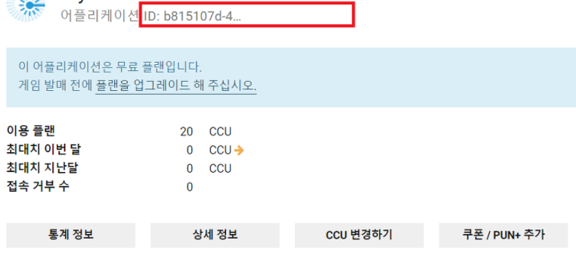
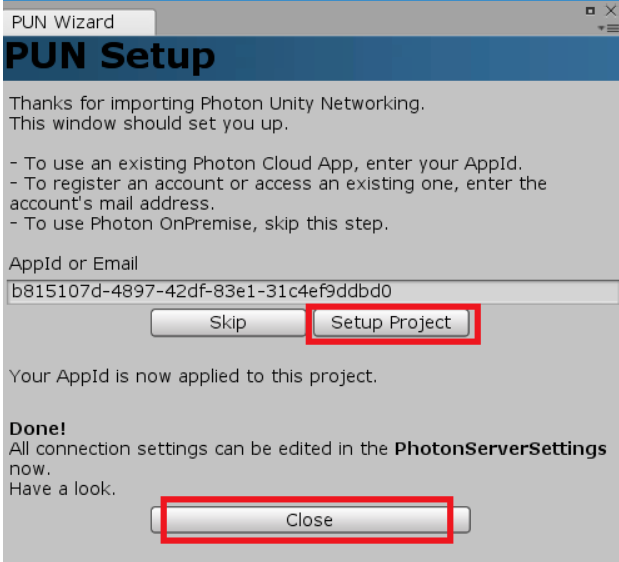
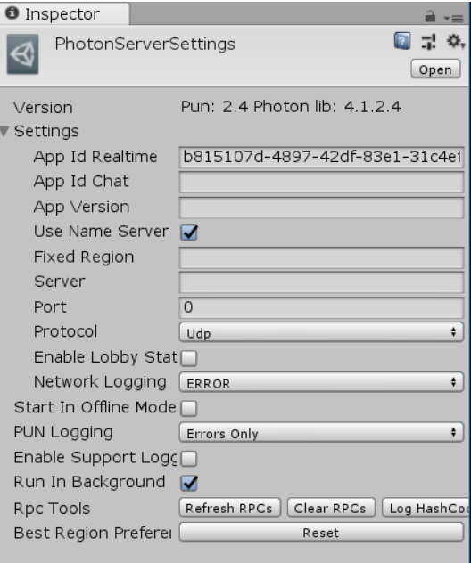
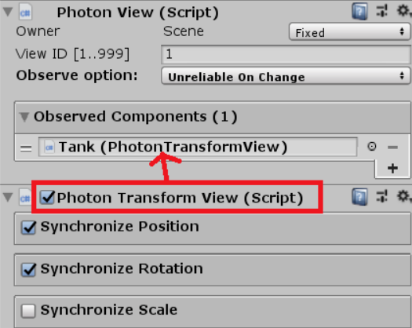
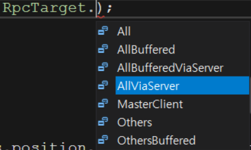

# Photon2
## 프로젝트 소개
- Photon2을 이용한 기본적인 네트워크 구성 학습. Photon2를 이용한 서버 접속 및 동기화, 방생성 및 채팅시스템에 대해 중점적으로 학습 해보았습니다.

### 포톤 기초
#### 포톤 서버 생성
- [포톤 홈페이지](https://dashboard.photonengine.com/ko-KR/)에서 새 어플리케이션 생성
- 생성된 아이디값을 유니티 포톤에 적용




#### 포톤 서버 셋팅


- APP Id Realtime: 포톤 네트워크를 사용하기 위한 ID 값
- App Id Chat: 포톤 챗팅을 사용하기 위한 ID 값
- App Version: 앱 버전을 적어주면 해당 버전의 프로그램을 사용하는 사람들끼리만 만남
- Protocol: TCP, UDP 통신규약 설정
- Start In Offline Mode: 네트워크를 사용하지 않고 프로그램 실행
- Run In BackGround: 포톤네트워크 활성화
- Network Logging: 네트워크 로그 출력
- PUN Logging: pun 로그 출력

#### 실시간 Transform 정보 공유
- 프리팹에 Photon View 스크립트와 Photon Transform View 스크립트를 붙여준다.



#### 포톤 프리팹 인식
- 포톤은 Resources 폴더 안에 있는 프리팹만 인식
- 객체 생성
    - PhotonNetwork.Instantiate(string objName, Vector3 pos, Quaternion rot)

#### 포톤네트워크 초기화
> using Photon.Pun;  
using Photon.Realtime;

> MonoBehaviourPuncallbacks를 상속 받아야 함

#### 일반 명령문
- 포톤 게임버전을 설정  (같은 게임버전끼리 공유됨)
    - PhotonView.Owner를 통해 접근 가능
    - PhotonNetwork.GameVersion = "게임버전"
- 클라이언트의 닉네임 설정
    - PhotonView.LocalPlayer를 통해 접근 가능
    - PhotonNetwork.NickName = "사용자 닉네임"
- 플레이어 리스트
    - PhotonNetwork.PlayerList
        - Length: 현재 방의 플레이어수
- 접속한 인원 수
    - Photonnetwork.CountOfPlayers
- 방 개수
    - Photonnetwork.CountOfRooms
- 모든방에 있는 인원 수
    - Photonnetwork.CountOfPlayersInRoom
- 포톤 네트워크에 연결되어 있는지 확인 
    - Photonnetwork.IsConnected
- 방에 있는지 확인
    - PhotonNetwork.InRoom
- 로비에 있는지 확인
    - PhotonNetwork.InLobby
#### 연결 명령문
- 같은방 동기화 (하나의 클라이언트가 룸내의 모든 클라이언트들에게 로드해야할 레벨을 정의)
    - PhotonNetwork.AutomaticallySyncScene = true
- 포톤을 이용한 온라인 연결
    - PhotonNetwork.ConnectUsingSettings()
- 포톤네트워크의 데이터 통신 중지
    - PhotonNetwork.IsMessageQueueRunning = false
- 네트워크 상태 확인
    - PhotonNetwork.NetworkClientState
- 접속 끊기
    - PhotonNetwork.Disconnect()
#### 로비 명령문
- 로비로 입장   
    - PhotonNetwork.JoinLobby()
#### 룸 명령문
- 방 생성  
    - PhotonNetwork.CreateRoom(null, new RoomOptions { MaxPlayers = "최대 인원" })
- 랜덤방 입장    
    - PhotonNetwork.JoinRandomRoom()
- 지정된 방에 입장   
    - PhotonNetwork.JoinRoom("방이름", null)
- 방을 떠남    
    - PhotonNetwork.LeaveRoom()
- 방의 이름이 존재하면 참가, 없다면 만듦
    - PhotonNetwork.JoinOrCreateRoom("방이름", new RoomOptions { MaxPlayers = 2}, null)
- 현재 방 정보
    - PhotonNetwork.CurrentRoom
        - MaxPlayers: 현재 방의 최대 입장 가능 인원

#### 연결 관련 콜백함수
- 접속시의 콜백 함수
    - public override void OnConnectedToMaster()
- 연결이 끊겼을 때의 콜백함수
    - public override void OnDisconnected(DisconnectCause cause)
#### 로비 관련 콜백함수
- 로비로 입장시의 콜백 함수
    - public override void OnJoinedLobby()
#### 룸 관련 콜백함수
- 방이 생성될때의 콜백함수
    - public override void OnCreateRoom()
- 방 생성이 실패했을 때의 콜백함수
    - public override void OnCreateRoomFailed(short returnCode, string message)
- 랜덤방 입장 실패시 콜백함수
    - public override void OnJoinRandomFailed(short returnCode, string message)
- 방에 입장시의 콜백 함수  
    - public override void OnJoinedRoom()
- 방을 떠날때의 콜백 함수
    - public override void OnLeftRoom()
- 플레이어가 방에 입장했을 때의 콜백 함수
    - public override void OnPlayerEnteredRoom(Player newPlayer)
- 플레이어가 방을 떠났을 때의 콜백 함수
    - public override void OnPlayerLeftRoom(Player otherPlayer)
- 방 리스트 업데이트시의 콜백 함수    
    - public override void OnRoomListUpdate(List<RoomInfo> roomList)

```c#
using Photon.Pun;  
using Photon.Realtime;

public class PhotonInit : MonoBehaviourPuncallbacks
{
    void Awake()
    {
        // photon1에서 photon2로 바뀌면서 달라진점 (같은방 동기화)
        PhotonNetwork.AutomaticallySyncScene = true;
    }

    void Start()
    {
        PhotonNetwork.GameVersion = "게임버전";
        PhotonNetwork.NickName = "사용자 닉네임"
        //PhotonView.Owner를 통해 사용 가능

        // 네트워크셋팅에 따른 포톤 네트워크 실행
        PhotonNetwork.ConnectUsingSettings();
    }

    public override void OnConnectedToMaster()
    {
        // 접속시 랜덤방 입장
        PhotonNetwork.JoinRandomRoom();
    }

    public override void OnJoinRandomFailed(short returnCode, string message)
    {
        // 랜덤방이 없는 경우 방 생성
        PhotonNetwork.CreateRoom(null, new RoomOptions { MaxPlayers = "최대 인원" });
    }

    public override void OnJoinedRoom()
    {
        // 방에 입장시 플레이어 생성
        PhotonNetwork.Instantiate("플레이어 생성");
    }
}
```

#### 본인의 오브젝트만 컨트롤하기
```c#
// 내 것인지를 체크
if(!photonView.IsMine)
{
    return;
}
```

#### RPC (Remote Procedure Call)
- 원격 프로시저 호출: 원격제어를 통해 함수나 프로시저의 실행을 허용하는 기술
    - 같은 룸에 있는 다른유저(클라이언트)의 함수를 실행하는 것
    - 프로시저 (Procedure): 어떤 행동을 수행하기 위한 일련의 작업 순서
- API 중 PhotonView 클래스
> void PhotonView.RPC(string methodName, PhotonTargets targets, params object[] parameters)

#### RPC - All과 AllBuffered의 차이
- All: 그 즉시 호출되어 사라짐
- AllBuffered: 재접속될때 호출

#### RPC 호출 관계
- 서로 다른 컴퓨터에서 연결되어 있을 때, 자신과 같은 객체의 PhotonView클래스를 가지고 있는 객체에게 RPC정보 전달
- 모든 객체에게 RPC정보를 전달하는 것이 아님



#### 포톤트랜스폼 뷰를 사용하지 않고 실시간 처리
- OnPhotonSerializeView를 사용하여 실시간으로 상태 동기화 가능
- PhotonView 클래스 Observed Components에 참조 하여 사용
- IPunObservable 인터페이스를 통해 변수를 감시하여 동기화해주는 원리
- 보내는 순서와 받는 순서가 같아야함
> IPunObservable 인터페이스 상속
```c#
Vector3 CurrentPos; // 실시간으로 전송하고 받는 변수
Quaternion CurrentRot; // 실시간으로 전송하고 받는 변수
public void OnPhotonSerializeView(PhotonStream stream, PhotonMessageInfo info)
{
    // 데이터를 계속 전송만
    if(stream.IsWriting)
    {
        stream.SendNext(transform.position); // 내 탱크의 위치값을 보낸다.
        stream.SendNext(transform.rotation); // 내 탱크의 회전값을 보낸다.
    }
    else
    {
        // stream.REceiveNext()는 반환형이 오브젝트 타입이기 때문에 캐스팅 필요
        currentPos = (Vector3)stream.ReceiveNext();
        currentRot = (Quaternion)stream.ReceiveNext();
    }
}
```

#### 채팅창 연동
- RPC를 이용해 msg 버퍼를 보내준다.
```c#
//msg를 RPC 버퍼에 보내준다
public void OnSendChatMsg()
{
    string msg = string.Format("[{0}] {1}"
    , PhotonNetwork.LocalPlayer.NickName
    , "보낼내용");
    photonView.RPC("ReceiveMsg", RpcTarget.OthersBuffered, msg);
    ReceiveMsg(msg)l
}

// RPC 버퍼에 있는 msg를 출력
[PunRPC]
void ReceiveMsg(string msg)
{
    msgList.text += "\n" + msg; 
}
```
#### 방 정보 업데이트
- Lobby로 전환 시 호출되는 콜백 함수 OnRoomListUpdate(List<RoomInfo> roomList)를 이용
- roomList.RemovedFromList를 통해 사라진 방인지 체크 가능